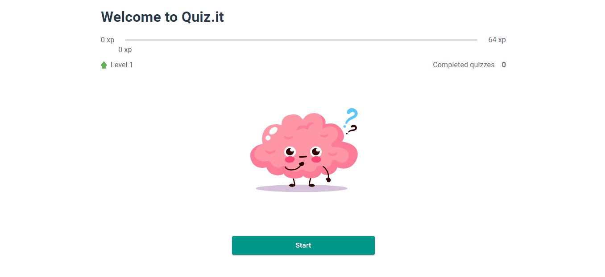

<h1 align="center">
<br>
  
<br>
<br>
Quiz.it
</h1>

<p align="center">A quiz app made with ReactJS, Material UI, Formik, in order to improve people's general knowledge about the world.</p>

[//]: # (Add your gifs/images here:)

### Demo

<a href="https://quizit-two.vercel.app/" target="_blank">Quiz.it in web</a>

<p align="center" style="display: flex; align-items: flex-start; justify-content: center;">
  
</p>

<hr />

## Features
[//]: # (Add the features of your project here:)
This app features all the latest tools and practices in web development!

- ⚛️ **ReactJS** — A JavaScript library for building user interfaces.
- 📝 **Formik** — Is the world's most popular open source form library for React and React Native.
- Ⓜ️ **Material UI** — React components for faster and easier web development.
- ✔️ **Yup** — Is a JavaScript schema builder for value parsing and validation.

## Getting started

1. Clone this repo using ```git clone https://github.com/williamoliverpro/quizit```.
2. Move yourself to the appropriate directory: cd quizit.
3. Run ```npm install``` or ```yarn``` to install dependencies.

### Development mode
4. Run ```npm run start``` or ```yarn start``` to start the application development mode.
Open [http://localhost:3000](http://localhost:3000) to view it in the browser.

### Build
4. Run ```npm run build``` or ```yarn build``` to build the application.